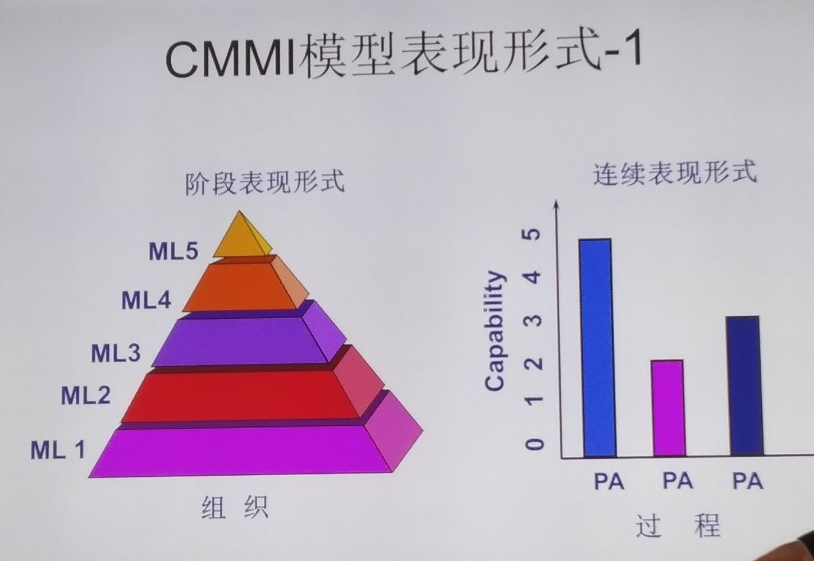

# CMMI软件过程

教师:周顺平
教室:东郊楼B0110

## 第二节课

### 质量管理思想演变

- 质量管理
- 目标管理
- 决策管理、组织管理、人事管理
- 战略管理
- 。。管理

## 第三节课

### 改进

基于模型的过程改进

“模型”是  
所研究的系统、过程、事务或概念的一种表达形式  
也可以指根据实验、图样放大或缩小而制作的样品，一般用于展览  

模型类型：  
过程模型  
数学模型  

#### 模型为什么重要

模型提供了：  

- 前任的起点
- 前人的经验

#### 过程模型的用途

- 过程评估(SPA), 由专业评估师对某个组织的软件过程进行鉴定  
  - 目的:
  - 确定当前过程的状态
  - 确定最为紧迫的问题
  - 获得组织支持  
- 能力评价(SCE), 由专业评估师对某个组织的软件过程进能力行鉴定
  - 识别有资格的承包商
  - 监控现有的过程状态
- 过程该井(SPI), 软件组织依据CMM模型指定软件过程改进计划

#### 过程相关模型

1. ISO9000
2. CMM
3. CMMI
4. SPICE

### CMMI

#### CMMI表现形式

阶段表示法  
连续表现法  

#### CMMI模型体系

1. CMMI-DEV
2. CMMI-SEV
3. CMMI-sss

### 过程域

#### CMMI第二级：已管理级/可重复级

|过程域|PA|
|----|----|
|需求管理|REQM|
|项目计划|PP|
|项目跟踪与监控|PMC|
|过程与产品质量保证|PPQA|
|配置管理|CM|
|度量与分析|MA|
|供应商协议管理|SAM|

#### CMMI第三级：已管理级

|过程域|PA|
|----|----|
|组织过程焦点|OPF|
|组织过程定义|OPD|
|组织培训|OT|
|集成项目管理|IPM|
|风险管理|RSKM|
|需求开发|RD|
|技术解决方案|TS|
|产品集成|PI|
|验证|VER|
|确认|VAL|
|决策分析与解决方案|DAR|

#### CMMI第四级：量化管理级

|过程域|PA|
|----|----|
|组织过程绩效|OPP|
|量化项目管理|QPM|

#### CMMI 第五级：优化级

|过程域|PA|
|----|----|
|组织绩效管理|OPM|
|原因分析与解决方案|CAR|

## 已定义级相关

- SG 1 Establish Estimates
  - ***SP 1.1*** Estimate the Scope of the Project
  - ***Sp 1.2*** Estimate Estimates of Work Product and Task Attributes
  - ***SP 1.3*** Define Project Lifecycle Phases
  - ***SP 1.4*** Estimate Effort and Cost
- SG 2 Develop a Project Plan
  - ???
- SG 3 Obtain Commitment to the Plan