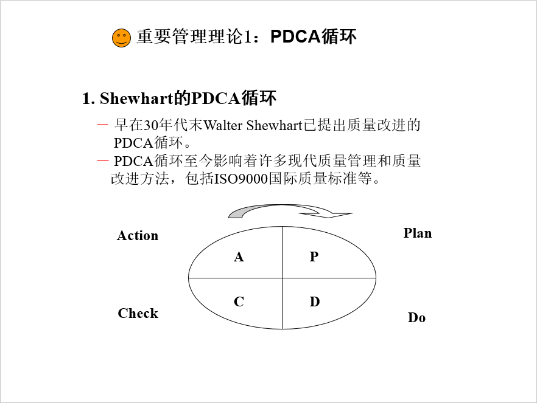
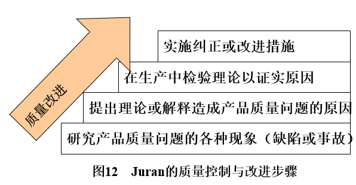
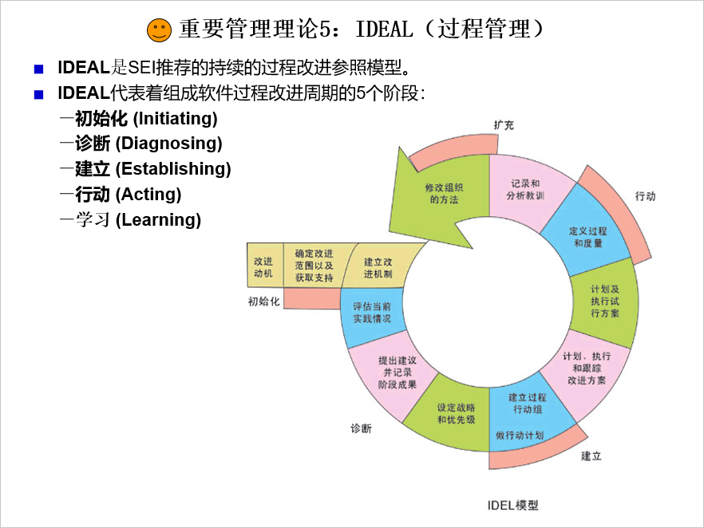

# CMMI

## 企业管理

企业管理是`质量、时间和成本`三要素的平衡

企业的绩效来源于`管理`，核心是`质量管理`

## 管理理论

### 1.PDCA理论

### 2.Juran质量改进4步骤

### 3.Deming理论

Deming 戴明

Deming的14条管理原则

1. 树立改进产品和服务的坚定目标
2. 采用新的思维方法
3. 停止依赖检验的办法获得质量
4. 不再凭价格标签进货
5. 坚持不懈的提高产品质量和生产率
6. 岗位培训制度化
7. 管理者的作用应突出强调
8. 排除畏难情绪
9. 打破部门和人员之间的障碍
10. 不再给操作人员提空洞的口号
11. 取消对操作人员规定的工作定额和指标
12. 不再采用按年度对工作人员进行评估
13. 创建积极的自我提高计划制度
14. 让每个员工都投入到提高产品质量的活动中去

### 4.TQM

TQM：全面质量管理 Total Quality Management

TQM的基本特点是`全员参加、全过程、全面运用一切有效办法、全面控制质量因素、力求全面提高经济效益的质量`管理模式

TQM还强调以下几个方面  

1. 用户第一
2. 预防
3. 定量分析
4. 工作质量为重点

TQM一般分为四个阶段：计划Plan、执行Do、检查Check、处理Action

### 5.IDEAL(过程管理)

## ISO

ISO即国际标准化组织  
International Organization for Standardization

### ISO9000标准之质量管理八项原则

1. 以顾客为关注焦点
2. 领导作用
3. 全员参与
4. 过程方法
5. 管理的系统方法
6. 持续改进
7. 基于事实的决策方法
8. 与供方互利的关系
