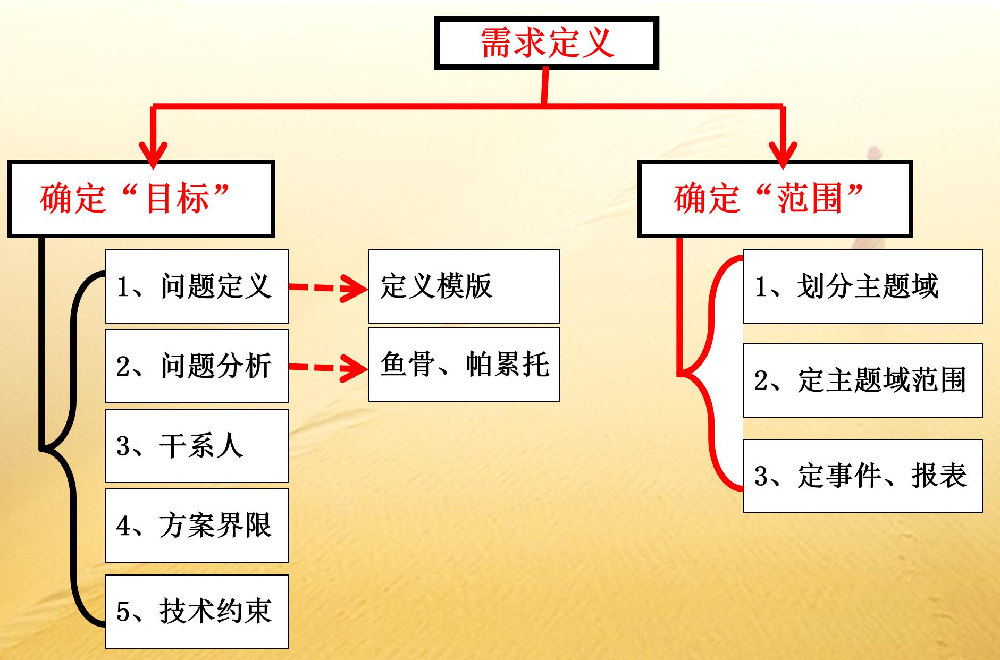
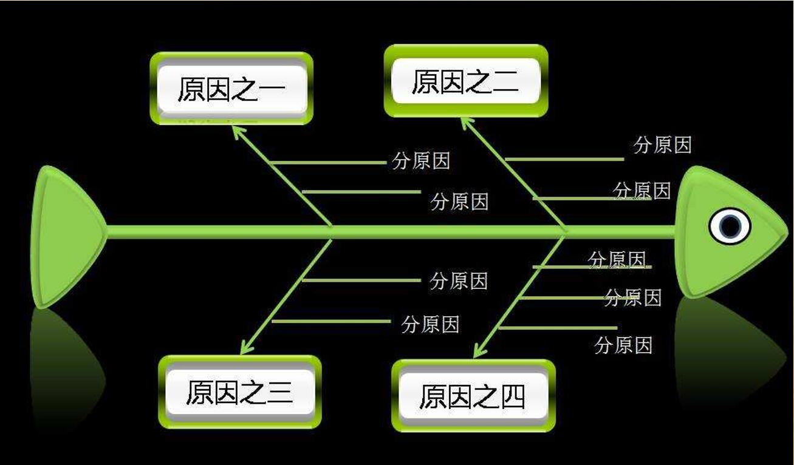

# 软件需求

## 1. 需求工程包括那两个部分

- 需求开发
  - 需求定义
  - 需求获取（捕捉）
  - 需求分析和建模
  - 需求描述
  - 需求验证
- 需求管理
  - 需求基线管理
  - 需求变更管理
  - 需求跟踪管理

## 2. 需求开发包括哪些基本过程？

- 需求定义
- 需求获取（捕捉）
- 需求分析和建模
- 需求描述
- 需求验证

## 3. 需求捕获有哪些基本策略？

1. 需求捕获是主动的
2. 需求捕获是聚焦的
3. 破解需求的冰山模型
4. 破解阻碍需求捕获的心理现象
5. 不要忽视对变更可能的捕获
6. 需求协商

### 3.1 什么是主动

- 主动收集资料、了解背景
- 主动学习业务知识，了解生产过程和现状
- 主动提出改进方案或信息化方案，研究和比较多种方案
- 了解客户/用户的组织结构、职责、工作规律
- 在恰当的时间适当的方式主动预约主要人员
- 预约客户时目标明确、时间明确，并有备选方案

总之:充分准备、考虑客户、主动担当 才是主动

### 3.2 冰山模型

意识到的需求  
无意识的需求  
未曾梦想的需求

## 4. 需求捕获有哪些基本方法？

## 5. 需求分析与建模分哪两个阶段？分别做什么？

## 6. 需求分析的第一个阶段包括哪些方面？

## 7. 需求分析的第二个阶段的任务是什么？

## 8. 需求管理包括哪些？

## 9. 什么是需求基线？

## 10. 需求管理的目的是什么？

## 11. 为什么需求跟踪要双向跟踪？

## 12. 需求变更影响分析从哪三个方面进行分析？

## 13. 需求变更的技术影响分析指的是什么？

## 14. 需求变更的业务影响分析指的是什么？

## 15. 需求变更的项目影响分析又是指什么？

---
讨论部分

---

## 1. 需求为什么重要？

## 2. 需求开发是不是就是充分收集用户的意见并加以整理？

## 3. 是不是所有的软件产品开发都要先找用户收集需求？

## 4. 需求开发的实质是什么？

---
附加

---

## 1. 软件需求分类

软件实现观点：

1. 功能需求
2. 非功能需求
3. 设计约束

## 2. 好的需求应该具有的特性

1. 无歧义性
2. 完整性
3. 一致性
4. 可检验性
5. 确定性
6. 可跟踪性
7. 正确性
8. 可行性
9. 必要性

## 3. 如何确定范围

1. 划分主题域
2. 确定主题域范围
3. 标识业务事件与报表