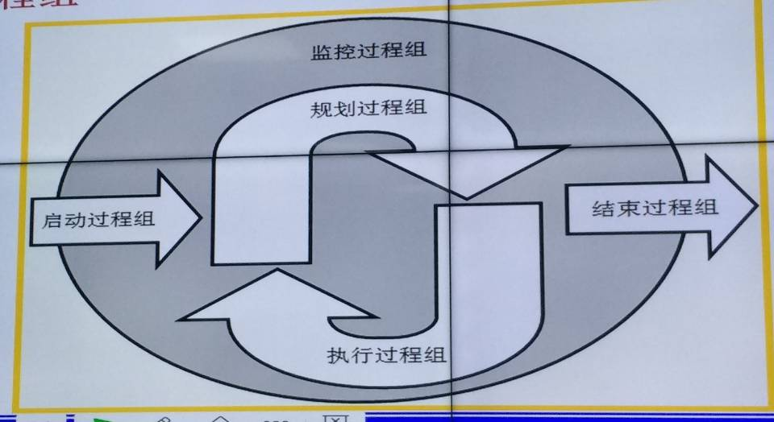
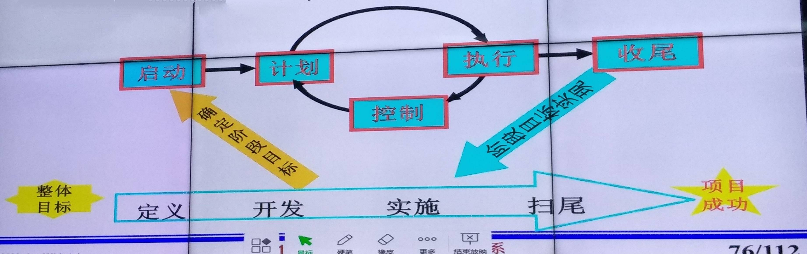
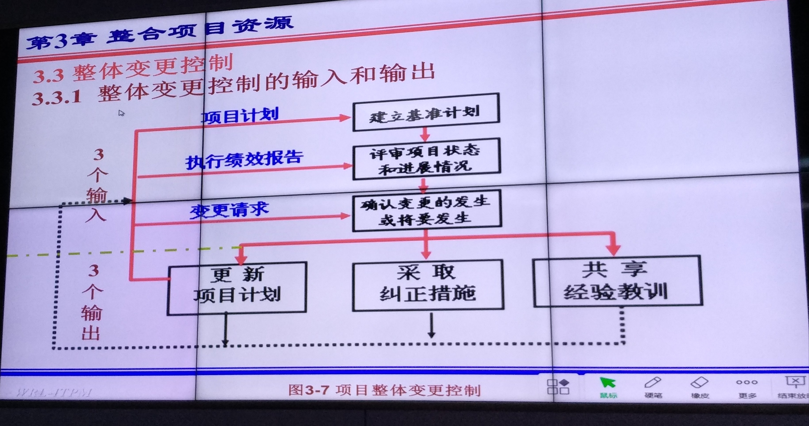

# 软件项目管理

`Information`  
`Technology`  
`Project`  
`Management`

* [第一节课](#第一节课)
  * [什么是项目](#什么是项目)
  * [项目管理](#项目管理)
* [第二节课](#第二节课)
  * [项目管理知识体系](#项目管理知识体系)
  * [走进IT项目](#走进IT项目)
  * [信息技术](#信息技术)
  * [信息化](#信息化)
  * [项目的几个阶段](#项目的几个阶段)
  * [项目几个阶段做什么?](#项目几个阶段做什么?)
  * [软件生命周期与项目生命周期](#软件生命周期与项目生命周期)
  * [ERP](#ERP)
  * [OA系统](#OA系统(办公自动化))
* [第四节课](#第四节课)
  * [回顾](#回顾)
  * [项目管理过程](#项目管理过程(5个))
  * [新课](#新课)
  * [项目管理过程组](#项目管理过程组)
  * [启动过程组](#启动过程组)
  * [规划过程组](#规划过程组)
  * [监控过程组](#规划过程组)
* [第五节课](#第五节课)
  * [过程组之间的关系](#过程组之间的关系)
* [第三章-整合新项目资源](#第三章-整合新项目资源)
  * [项目进度](#项目进度)
  * [整合项目资源概述](#整合项目资源概述)
  * [IT项目经理](#IT项目经理)
  * [高层管理人员的支持](#高层管理人员的支持)

## 第一节课

### 什么是项目

>一系列任务(很多任务的集合)  
>人物之间有逻辑秩序  
>有评价标准(有工作要求、目标要求)  
>有限时间(有明确的开始时间和结束时间)
>项目有不确定性  
>项目可以利用的资源有限  
>每一个项目都不相同

### 项目管理

>主要方面
>1、范围管理  
>2、成本管理  
>3、进度管理  
>4、质量管理
>
主线
>5、整体管理
>
辅助方面  
>6、风险管理  
>7、沟通管理  
>8、人力资源管理  
>9、采购(外包)管理  
>
额外
>10、关系人  

---
---
---

## 第二节课

### 项目管理知识体系

1、PMI & PMBOK  
>9大知识领域(上面的，除去额外的那条)  
>确保项目所有的组成要素在正确的时间结合在一起  

### 走进IT项目

信息技术的迅猛发展，使得信息技术越来越重要  
任何有信息`生成`和`需求`的组织机构和个人都需要信息化  

### 信息技术

信息技术：是在信息科学的基本原理和方法的知道下拓展人类处理信息能力的技术  
以电子计算机和现代通信技术为基础  
人本身就是一个高度完善的信息处理系统  
信息技术主要包括`传感技术`、`通讯技术`、`计算机技术`和`控制技术`等  
`信息是有价值的数据集合`(有一定含义，经过加工的才叫做数据)

### 信息化

信息化是指在各领域、各层次有效开发利用信息资源，建立信息基础设施，发展信息技术，
加快进步，提高综合实力，提高生活、工作水平

### 项目的几个阶段

定义  
>↓项目可行性阶段  
>
开发  
实施
>↓项目获取阶段  
>
收尾

### 项目几个阶段做什么？

>定义  
>>制定项目建议书  
>>描述为什么要做这个项目
>
>开发
>>规划项目怎么做  
>>谁来做  
>>制定更加详细的项目计划
>
>实施
>>执行项目计划  
>>完成项目监督
>
>收尾
>>项目验收  
>>产出验收报告  
>>功能测试  
>>项目总结  
>>项目人员的遣散和安置  

### 软件生命周期与项目生命周期

>软件生命周期  
>>从提出软件开始，到最后停止使用为止
>
>项目生命周期
>>上述几条  
>>定义-开发-实施-收尾
>
>简言之，软件生命周期包含项目生命周期

### ERP

>企业资源计划  
>是一个系统  
>是自动的

### OA系统(办公自动化)

---
---
---

## 第四节课

### 回顾

>企业文化:  
>共同的信念, 愿景  
>共同的制度, 规则  
>企业的结构, 组织  
>团队意识  

### 项目管理过程(5个)

>监控(总体, 全局过程)  
>开始(启动): 签合同/项目立项  
>规划(计划)  
>实施  
>结束  

---
---
---

### 新课

### 项目管理过程组

>启动过程组:
>>确定并核准项目或项目阶段
>
>规划过程组:
>>
>
>执行过程组:
>>整合资源, 有效的实施项目计划
>
>监控过程组:
>>定期测量和实时监控项目进展情况  
>>在有效的时间、成本和质量限制范围内或者满意的结果
>
>收尾过程组:
>>正式验收  
>>项目审计  
>>项目解散的合理安置  

---
---
---

### 启动过程组

>原则:  
>要明确能做哪些事情, 还要明确不能做哪些事情  
>要明确完成的任务, 还要明确完成这些任务的约束条件和验收标准  
>要关注需要获得的成果, 还要关注采用哪样的过程获得的成果  
>
>确认项目经理  
>通过PMP认证确认项目经理  
>`Project Management Professional`  

### 规划过程组

>项目必须要能够实施  

### 监控过程组

>QA  
>确保项目的实现  
>通过观察项目的执行情况, 及时的发现项目潜在的问题,并在必要时采取纠正行动, 有效的控制项目进程
>
>对项目管理佳话是项目实施准则来严格件事正在进行的项目活动  
>对妨碍整体变更控制的因素施加影响  
>
>对过成进行监控, 而不是在形成结果之后进行监控  

---
---
---

## 第五节课

### 过程组之间的关系

【图片】102页ppt

`从下一章开始，我要换一种方式写文档，按照章节格式来写`

---
---
---

## 第三章 整合项目资源

### 整合项目资源概述

【文字】6/64  
【图片】6/64  

项目整体管理任务是在项目生命周期中协调所在其他项目管理知识领域所设计的过程  
它确保项目所有的组成要素....(未完)

### 项目干系人分析

项目干系人是指与项目相关的人，包括参与项目和受项目活动影响的人  

人员组成：
>项目组内部与外部  
>客户  
>用户  
>反对项目人  

### IT项目项目经理

主要指承包方项目项目负责人  
甲方也可以委派一个项目负责人辅助  

---

### 项目经理的地位和作用

个人负责制  
项目的最高领导人、组织者、负责者  
项目有关的各方协调，处于各方的核心阶段  
各种重要指标、计划、方案、措施、制度的决策人和制定人

### 项目经理的责任和权力

责任
>确保项目目标实现  
>指定项目阶段性目标和项目总体控制计划  
>组织精干的项目管理班子  
>即使决策  
>履行合同义务，监督合同执行，处理合同变更

职责
>指挥权  
>人事权  
>财权  
>技术工作权等

### 项目经理的素质要求

>道德  
>健康的身体和心理  
>客户意识  
>专业素养  
>大局观  
>项目管理能力  
>信心与意志  
>胆大心细

### 高层管理人员的支持

项目经理需要从高层管理人员获得支持  
`原因:`  
>获取足够的资源  
>特殊的审批  
>跨部门，跨组织的协调  
>高层的指导和帮助

---
`售前营销，售后技术支持`  
`多么痛苦的领悟`

---

### 项目管理计划

项目计划是一个用来协调所有其他计划，以知道项目执行和控制的可操作文件  

### 项目管理计划的内容

记录假设，方案选择  
审查的内容、范围、时间  
为项目评测和控制提供要给基准

具有动态性和灵活性

有利于项目经理管理项目和评估项目的进展状况

项目计划和项目执行相互渗透

项目管理计划的内容包括：
>整体介绍
>>项目名称  
>>背景简介  
>>需求的简单描述  
>>发起人名称  
>>成员简介  
>>可交付成果  
>>资料清单  
>>有关定义和缩写词说明
>
>组织情况描述
>>组织结构图
>>项目责任  
>>与组织有关的信息  
>
>主要方法
>>管理目标
>>>上层想法  
>>>优先考虑  
>>>假设条件和限制条件  
>>
>>项目控制  
>>>方法、规则和工具  
>>>变更控制  
>>>变更需要哪个管理层的批准  
>>
>>风险管理  
>>>风险的识别、管理、控制
>>
>>项目人员  
>>技术过程

### 项目任务主要包括

>主要的工作内容
>>WBS分解成工作包  
>>SOW描述细节
>
>主要交付的成果  
>>提交的产品与提交方式  
>
>工作有关的其他信息

### 项目进度

>进度概要
>>成果和完成日期

### 项目预算

预算概要  
预算细要  
其他信息

### WBS

WBS：工作分解结构（Work Breakdown Structure）  
创建WBS：创建WBS是把项目，交付成果和项目工作分解成较小的，更易于管理的组成部分的过程。  
WBS的基本定义：以可交付成果为导向对项目要素进行的分组，它归纳和定义了项目的整个工作范围每下降一层代表对项目工作的更详细定义。

### 项目计划的实施

### 实施项目管理计划

已计划为准绳的积极的引导，始终是项目成功的关键  

没有好的计划就不可能有好的结果，有好的计划，不加强控制和监督也很难得到满意的结果  

项目经理指定的计划影响着其他人的效率

### 变更控制

正是软件项目及其生产的产品的这些特性，使得软件项目管理的成败在某种意义上而言，取决于整体变更控制的好坏

整体变更控制：变更识别、评价和管理

### 整体变更控制的输入和输出

变更控制系统指规定项目绩效如何检测与评估的一组正式的、有文件记载的程序。

变更控制系统规定了正式项目文件变更需要经过的步骤，给出了核准变更所需要的表格填写、系统追踪、各项过程以及逐级进行的审批。

### 变更控制系统

### 配置管理

配置管理用于保证项目产品描述的正确性和完整性

配置管理包括：
    识别并记载对象或系统的功能二号物理特性  
    控制特性的变更  
    记录并报告....

### 管理整体变更控制的方法

为变更确定计划  
运用配置管理  
建立正式的变更控制系统，包括CCB  

## 第四章 控制项目范围

项目范围 == 项目需求  
项目做什么

### 项目范围管理概述

缺少正确的项目需求、定义和范围核实是导致项目失败的主要原因  
目前IT项目最大的问题是项目需求与范围的不确定性和易动性  
做对的事情比把事情做好更重要  
IT项目的成功从需求开始，优秀的需求分析与设计人员是IT成功之本  

#### 项目范围的管理定义

项目范围是指产生秀昂木产品阶段包括`所有工作`以及产生这些产品经过的`所有过程`

项目范围的定义包括：  

* 项目产品范围  
* 项目工作范围

#### 项目范围管理的步骤

1. 发客户的需求转变为对项目产品的定义
2. 根据项目目标与产品分解结构，把项目产品的定义转变为对项目工作范围的说明
3. 通过工作分解结构，定义项目工作范围
4. 项目干系人认可并接受项目范围
5. 授权与执行项目工作，并对项目进展进行控制

    需求规格说明书：`功能与性能`

#### 项目范围管理的重要性

范围蔓延  
无法得到其他项目组的认可  
只有完成项目范围中的全部工作项目才能结束  
起到的作用  

* 提高费用、时间和资源估算的准确性
* 确定进度测量和控制的基准  
* 有助于项目分工([WBS分解](#WBS))

#### 项目范围管理过程

图片

### 项目启动

#### 项目背景信息

基本信息:  
[×] 项目采用的新技术将会怎样影响使用者  
[×] 项目采用的新技术将会对其他软件产生什么影响  
[×] 新技术与兼容性  
[×] 新技术的风险大小  
[×] 新技术的业绩如何  
[×] 网络建设情况如何

### 4.3 项目范围规划

项目的范围是对项目的界限进行的定义，范围是项目中交付成果的综合  
范围的确定是逐渐进行的，从最开始对于项目最终交付成果的概念，到在项目发展中对于交付成果越来越细节描述的文件，逐步深入  
项目应该交付所有在项目范围内所描述的乃荣，范围内不包括的任何工作都不应该在项目中展开  
范围规划的任务包括`确定项目范围`，`明确项目的主要可交付成果`，`指定项目范围管理计划`，`记载如何确定、核实与控制项目范围`，以及如何指定与定义[WBS](#WBS)  
`项目范围的确定与管理直接关系到项目的整体成功`

#### 4.3.1 范围规划的依据

范围的规划建立在项目启动的基础上，主要应该考虑如下因素和依据：  

1. 环境因素
2. 组织过程资产
3. 项目章程
4. 项目初步范围说明书

#### 4.3.2 项目范围管理计划