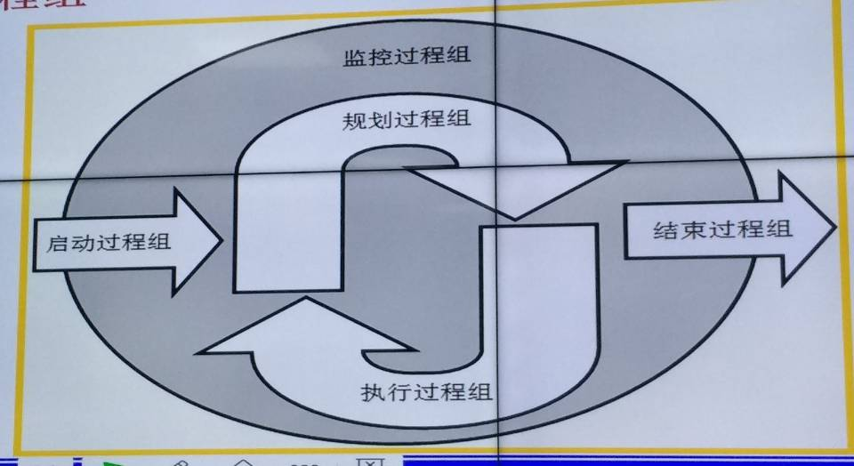
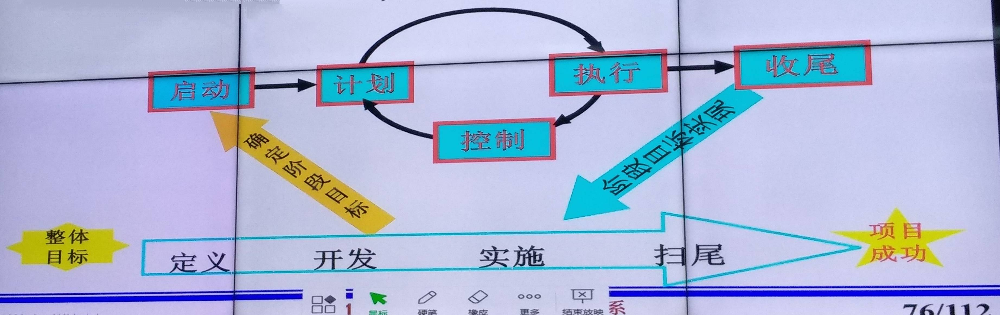

# 软件项目管理

`Information`  
`Technology`  
`Project`  
`Management`

## 第一节课

* 什么是项目

> 一系列任务(很多任务的集合)  
> 人物之间有逻辑秩序  
> 有评价标准(有工作要求、目标要求)  
> 有限时间(有明确的开始时间和结束时间)
> 项目有不确定性  
> 项目可以利用的资源有限  
> 每一个项目都不相同

* 项目管理

>主要方面
>> 1、范围管理  
>> 2、成本管理  
>> 3、进度管理  
>> 4、质量管理
>
> 主线
>> 5、整体管理
>
> 辅助方面  
>> 6、风险管理  
>> 7、沟通管理  
>> 8、人力资源管理  
>> 9、采购(外包)管理  
>
> 额外
>> 10、关系人  

## 第二节课

* 项目管理知识体系
> 1、PMI & PMBOK  
>> 9大知识领域(上面的，除去额外的那条)  
>> 确保项目所有的组成要素在正确的时间结合在一起  

* 走进IT项目
> 信息技术的迅猛发展，使得信息技术越来越重要  
> 任何有信息`生成`和`需求`的组织机构和个人都需要信息化  

* 信息技术
> 信息技术：是在信息科学的基本原理和方法的知道下拓展人类处理信息能力的技术  
> 以电子计算机和现代通信技术为基础  
> 人本身就是一个高度完善的信息处理系统  
> 信息技术主要包括`传感技术`、`通讯技术`、`计算机技术`和`控制技术`等  
> `信息是有价值的数据集合`(有一定含义，经过加工的才叫做数据)

* 信息化
> 信息化是指在各领域、各层次有效开发利用信息资源，建立信息基础设施，发展信息技术，
> 加快进步，提高综合实力，提高生活、工作水平

* 项目的几个阶段
> 定义  
>> ↓项目可行性阶段  
>
> 开发  
> 实施
>> ↓项目获取阶段  
>
> 收尾

* 项目几个阶段做什么?

>定义  
>>制定项目建议书  
>>描述为什么要做这个项目
>
>开发
>>规划项目怎么做  
>>谁来做  
>>制定更加详细的项目计划
>
>实施
>>执行项目计划  
>>完成项目监督
>
>收尾
>>项目验收  
>>产出验收报告  
>>功能测试  
>>项目总结  
>>项目人员的遣散和安置  

* 软件生命周期与项目生命周期

>软件生命周期  
>>从提出软件开始，到最后停止使用为止
>
>项目生命周期
>>上述几条  
>>定义-开发-实施-收尾
>
>简言之，软件生命周期包含项目生命周期

* ERP

>企业资源计划  
>是一个系统  
>是自动的

* OA系统(办公自动化)

## 第四节课

### 回顾

>企业文化:  
>共同的信念, 愿景  
>共同的制度, 规则  
>企业的结构, 组织  
>团队意识  

* 项目管理过程(5个)

>监控(总体, 全局过程)  
>开始(启动): 签合同/项目立项  
>规划(计划)  
>实施  
>结束  

---
---
---

### 新课

* 项目管理过程组

>启动过程组:
>>确定并核准项目或项目阶段
>
>规划过程组:
>>
>
>执行过程组:
>>整合资源, 有效的实施项目计划
>
>监控过程组:
>>定期测量和实时监控项目进展情况  
>>在有效的时间、成本和质量限制范围内或者满意的结果
>
>收尾过程组:
>>正式验收  
>>项目审计  
>>项目解散的合理安置  

---
---
---

* 启动过程组

>原则:  
>要明确能做哪些事情, 还要明确不能做哪些事情  
>要明确完成的任务, 还要明确完成这些任务的约束条件和验收标准  
>要关注需要获得的成果, 还要关注采用哪样的过程获得的成果  
>
>确认项目经理  
>通过PMP认证确认项目经理  
>`Project Management Professional`  

* 规划过程组

>项目必须要能够实施  

* 监控过程组

>QA  
>确保项目的实现  
>通过观察项目的执行情况, 及时的发现项目潜在的问题,并在必要时采取纠正行动, 有效的控制项目进程
>
>对项目管理佳话是项目实施准则来严格件事正在进行的项目活动  
>对妨碍整体变更控制的因素施加影响  
>
>对过成进行监控, 而不是在形成结果之后进行监控